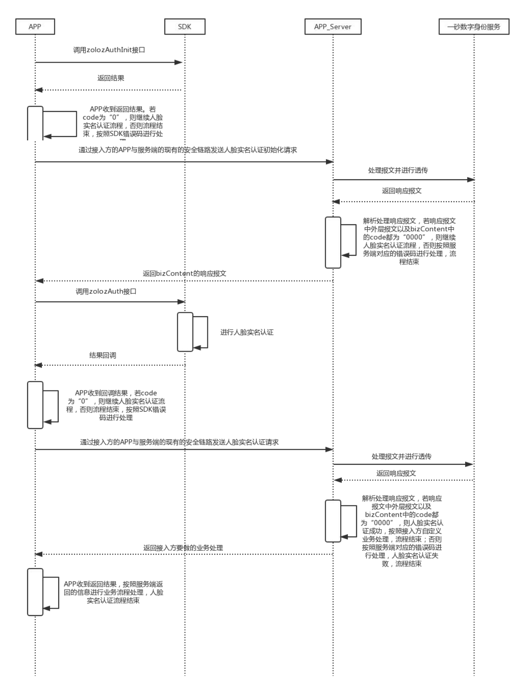

<div style="text-align:center;font-size:30px;font-weight:bold;">IFAA接入说明文档</div>

<br />

<div style="text-align:center;font-weight:bold;">（Android 版本）</div>


<br />
<br />


<table style="width:100%; border-collapse: collapse; text-align: center;">
	<tr style="height:35px">
	  <th style="text-align:center;">时间</th>
	  <th style="text-align:center;">版本</th>
	  <th style="text-align:center;">描述</th>
	  <th style="text-align:center;">作者</th>
	</tr>
	<tr  style="height:35px">
	  <td style="text-align:center;">2019/5/8</td>
	  <td style="text-align:center;">1.1.0</td>
	  <td style="text-align:center;">版本创建</td>
	  <td style="text-align:center;">黄子烨</td>
	</tr>
	<tr  style="height:35px">
	  <td style="text-align:center;"></td>
	  <td style="text-align:center;"></td>
	  <td style="text-align:center;"></td>
	  <td style="text-align:center;"></td>
	</tr>
	<tr  style="height:35px">
	  <td style="text-align:center;"></td>
	  <td style="text-align:center;"></td>
	  <td style="text-align:center;"></td>
	  <td style="text-align:center;"></td>
	</tr>
	<tr  style="height:35px">
	  <td style="text-align:center;"></td>
	  <td style="text-align:center;"></td>
	  <td style="text-align:center;"></td>
	  <td style="text-align:center;"></td>
	</tr>
</table>


<br />
<br />
<br />


# 1 概述

## 1.1 编写目的

本设计说明文档的编写目的是为了方便接入方快速接入 zoloz 实名认证服务。


## 1.2 适用范围


本文档适用 Android 端需要接入实名认证服务的接入方。


## 1.3 使用

### 1.3.1 引入 SDK 包


`Zoloz` SDK 提供了号码认证的能力，需要在 APP 的 `build.gradle` 中添加依赖


```
// 离线基础包，测试环境使用
debugImplementation (name:'esand_cloud_core-debug.1.0.0',ext:'aar')
// 离线基础包，正式环境使用
releaseImplementation (name:'esand_cloud_core-release.1.0.0',ext:'aar')
// 测试环境使用
debugImplementation (name:'esand_cloud_zoloz-debug',ext:'aar')
// 正式环境使用
releaseImplementation (name:'esand_cloud_zoloz-release',ext:'aar')
//zoloz 需要的第三方包
implementation(name: 'deviceid-release-6.0.2.20171228', ext: 'aar')
implementation files('libs/fastjson-1.2.2.jar')
implementation(name: 'zoloz-sdk-3.0.0.00000027', ext: 'aar')
```


### 1.3.2 初始化 `ZolozBaseInfo`


在使用 Android SDK 前需要初始化 `ZolozBaseInfo`。


```
/**
* 初始化数据
*/
private void initZolozBaseInfo () {
    mZolozBaseInfo = new ZolozBaseInfo(this);
    // 一砂下发的 APPID
    mZolozBaseInfo.setAppId("2019031500000008");
    // 业务 ID, 请保持唯一，根据给定规则进行生成，方法见 demo。当出问题时候，查问题用
    mZolozBaseInfo.setTransactionId(getTransId("ZOLOZ"));
    // 业务的附加信息，记录在 log 中，当出问题时，查问题用
    mZolozBaseInfo.setTransactionPayload("transPayload");
    // 姓名
    mZolozBaseInfo.setCertName(mCertName);
    // 身份证号码
    mZolozBaseInfo.setCertNo(mCertNo);
}
```


### 1.3.3 初始化管理类 `ZolozManager`




<p style="text-align:center;">初始化管理类</p>


```
// ZolozManager 管理类
ZolozManager zolozManager = new ZolozManager(zolozBaseInfo);
```


`ZolozManager` 中提供了 2 个方法：`认证初始化`、`认证`。


### 1.3.4 认证初始化


```
public ZolozResult zolozAuthInit() {}
```

- 入参：无

- 出参： `ZolozResult zolozResult`，当 `zolozResult.getCode()`为 `SUCCESS` 时， `zolozResult.getMessage()` 为发送到服务端的报文。


### 1.3.5 认证


```
public void zolozAuth(String zolozAuthInitResponse, ZolozCallback zolozCallback) {}
```


- 入参：

1. `String zolozAuthInitResponse`


服务端返回报文（客户服务端需要解析此次返回报文，当服务端返回 `bizContent` 中的 `code` 属性值为 `“0000”`
时，调用该接口，进行认证操作。其他情况按照服务端错误 `code` 列表进行相应的业务处理）


2. `ZolozCallback zolozCallback`


该回调中有1个实现：`onResult`。

`onResult` 返回 `ZolozResult`，当 `zolozResult.getCode()` 为 `SUCCESS` 时，
`zolozResult.getMessage()` 为发送到服务端的报文。服务端返回报文后，客户服务端需要解析此次返回报
文，当服务端返回 `bizContent` 中的 `code` 属性值为`“0000”`时，认证成功。其他情况按照服务端错误 `code`
列表进行相应的业务处理


- 出参：无


## 1.4 错误码


### 1.4.1 `ZolozResult` 实体类中的 `code` 值


| 常量名 | 常量值（String） | 业务意义 |
| --- | --- | --- |
| SUCCESS | 0 | 本地成功 |
| ZOLOZ_SYSTEM_ERROR | 1 | 系统错误 |
| ZOLOZ_CANCEL | 2 | 用户取消 |
| ZOLOZ_NET_ERROR | 3 | 切换账号 |
| ZOLOZ_FAILED | 4 | 刷脸失败 |
| ZOLOZ_SERVER_ERROR | 5 | 服务端错误 |


